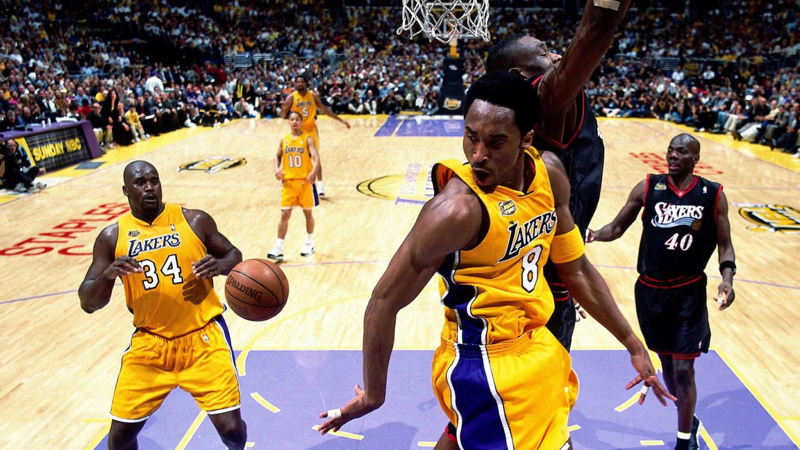
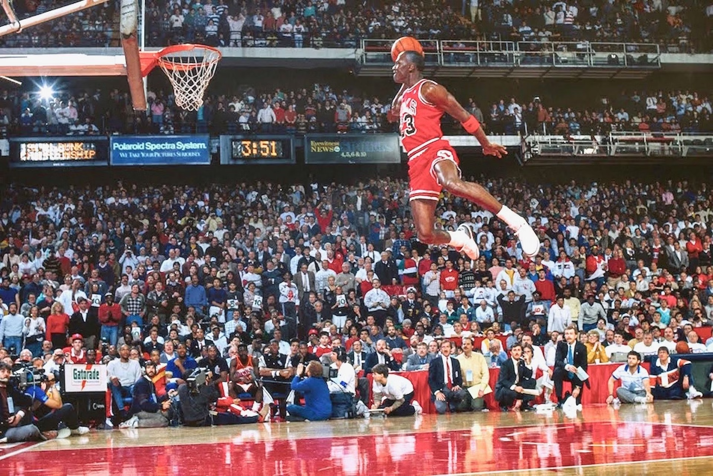
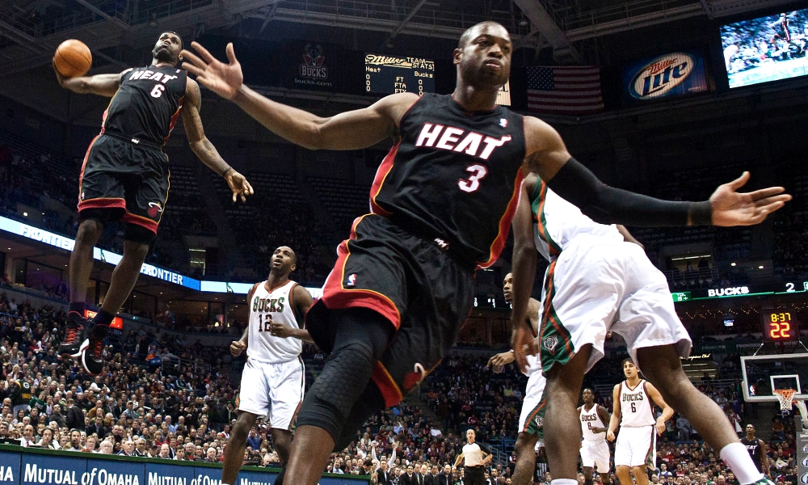
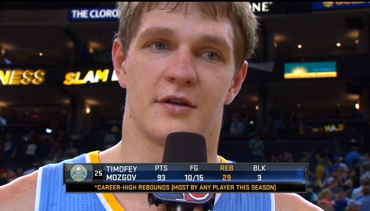

# NBA Play-Off Simulation
#### Predict results of NBA Play-Off series based on regular season results
----

## Requirements
Project is implemented using [`Python`](https://www.python.org/) and the following libraries:
- `pandas`
- `scikit-learn`
- `numpy`
- `matplotlib`
- `tqdm`

Libraries can be installed using `pip`:
```
pip install pandas scikit-learn numpy matplotlib tqdm
```

## Problem statement
Basketball is one of the most popular sports in the world [(1)](https://news.topsport.com.au/ranked-the-worlds-most-popular-sports/), [(2)](https://thesporting.blog/blog/the-most-popular-sports-in-the-world) while the most popular basketball league is definitely the National Basketball Association (NBA) [(3)](https://www.onlinebettingacademy.com/blog/2023/06/top-ten-basketball-leagues). Images below show only small part of the best NBA players that a lot of unfamiliar people probably know as well. These players have already earned (or will earn) the place in NBA Hall of Fame.


|  |  | 
|:--:|:--:| 
| <font size="5">Kobe Bryant (8) and Shaquille O'Neal (34)</font>| <font size="5">Michael Jordan</font> |
|  |  | 
| <font size="5">LeBron James (6) and Dwyane Wade (3)</font>| <font size="5">Timofey Mozgov - 2015/16 NBA champion</font> |

*P.S. There was a typo in Mozgov's score, he definitely earned less points, it is just a joke*
<!-- *Table (1): One of the best and famous NBA players* -->


Any basketball fan would love to attend the NBA match in real life. Unfortunately, a lot of fans (like me) live on other half of the world, which makes it difficult to attend or even watch matches online due to the different time-zones. For example, if you live in Moscow time-zone, then matches start around **1AM** and end at **7AM** (if you want to watch several games). Hence, we either have to sacrifice our sleep schedule or skip match of the favourite team. What would be even more sad if you decide to wake up early and your team loses.

Therefore, the idea for my project arised. What if I can predict the match outcome (at least approximately) and decide if I want to sacrifice my sleep for that night. However, predicting each match would be the tedious task. Moreover, I need some data to use as foundation for predictions and since each season players switch teams, predictions would be wrong for first games. Hence, I decided to simulate only Play-Off stages. The basic steps are the following:
1. Extract mathces results for given season with detailed statistics;
2. Train Machine Learning (ML) model on that data;
3. Insert teams participating in Play-Off;
4. Simulate each Play-off round for each pair of teams eventually predicting the champion.

## Solution

### Data
For this project I used dataset from [Kaggle](https://www.kaggle.com/datasets/nathanlauga/nba-games/data) that was collected from website with detailed statistic [Basketball reference](https://www.basketball-reference.com/). The main datasets that we will use are `games.csv` (games information) and `teams.csv` (teams information for convenient visualization). However, I added 2 extra files with season schedule (`season_schedule.csv`) and teams participating in Play-Off for given seasons (`play_off_teams.csv`). Of course Play-off pairs generation may be automated, because there is table with team ranking but we would need to apply many filters to get useful information and handle situations if some teams have the same number of wins in season, so let us use hand-written data for now.

### Model
Since problem can be stated as binary classification I decided to use one of the following models:
- Logistic Regression
- Decision Tree Classifier
- Random Forest Classifier
- Support Vector Classifier
- K-Nearest Neighbours
- Gaussian Naiive Classifier

For each given season I selected only regular-season games, splitted data into train and test datasets, trained each model and computed metrics values (*accuracy, recall, precision, f1-score*). After that I computed average value of each metric. Analyzing results I decided to use *Logistic Regression* model for the simulation

### Simulation
For the simulation I used the following algorithm:
1. Train model for the selected season using results of regular-season games.
2. Compute each team average statstics for that season.
3. Simulate 7-games series for teams participating in play-off.
4. Predict winner of each series using trained model.
5. Repeat steps 3-4 until one winner remains. It is the champion.

For more realistic simulation I also slightly tuned team statistics in each game (add or substract small value). Also, each 7-games series is simulated *n* times and the winner with the most number of wins in the series is counted as winner of the series and moves to the next round.

## Results
In 33% (6/18) of the cases the champion is predicted correctly, which may not be as satisfying as expected but still good results. Moreover, intermediate results are close to real-life outcomes and errors may be exaplained. For example, for the season 2018-2019 the model predicted that **Golden State Warriors (GSW)** should become a champion, however, in reality they didn't become champions. One of the reasons of that is that 2 of their lead players (Kevin Durant and Klay Thompson) got injuries, which model couldn't predict.

